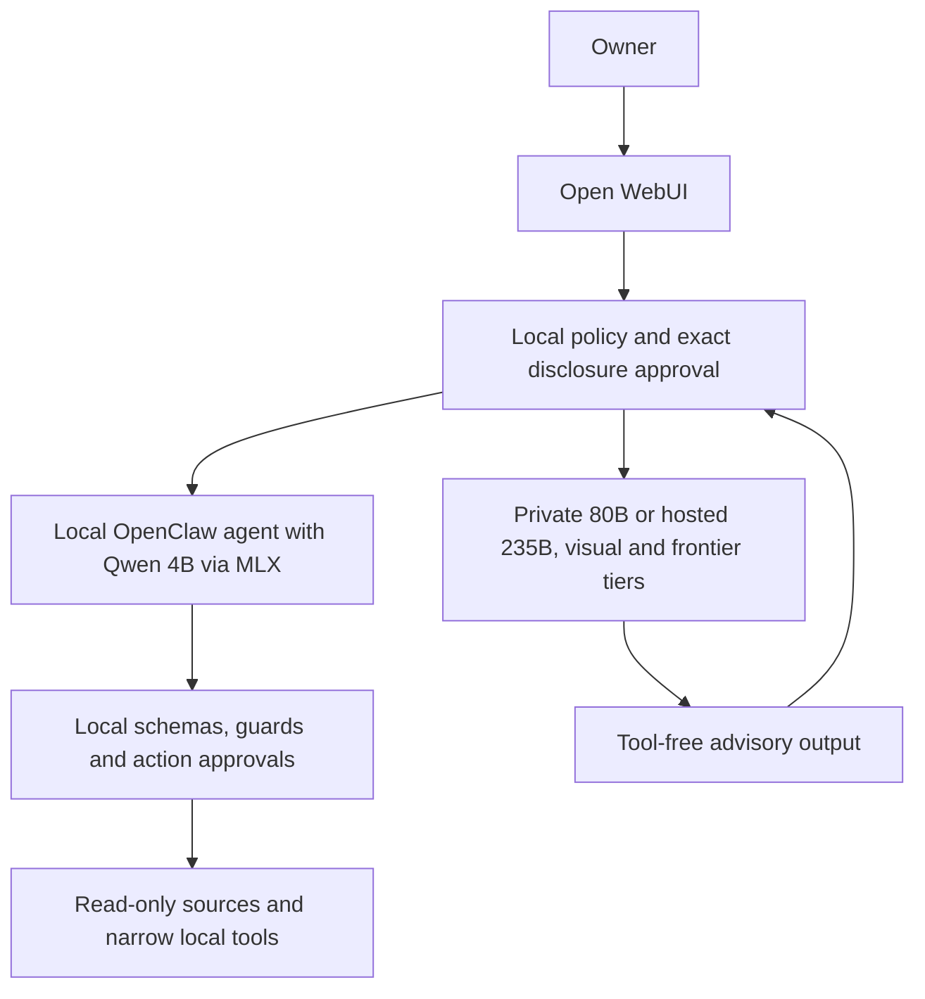

<p align="center">
  
</p>

# Sanctum

**Local authority for hybrid personal AI.**

Own the authority. Rent the intelligence when you need it.

Sanctum keeps credentials, tools, approvals and privacy policy on your machine while reasoning can move between local, private and hosted models. It exists to make a personal assistant useful without making a model mistake an unrestricted computer action.

**Reasoning is replaceable. Authority stays local.**

## V1 status

Sanctum V1.1.0 is **complete with documented limitations**. This minor release adds the accepted shared-capability foundation, Source-First evidence path, private Qwen Work Mode, and exact structured editing boundary. The original V1.0.0 release and tag remain immutable. The original deployment was called **VinceAI** and remains the reference installation; publication does not migrate it. Source and documentation use [Apache-2.0](LICENSE), with [external licenses retained](THIRD-PARTY-NOTICES.md).

Full operation targets **macOS on Apple Silicon**. This is **hybrid packaged / container-assisted** software: MLX, personal-source brokers, credentials, approvals and GPU cleanup intentionally remain host-native. Optional containers provide a small fixed MCP surface.

## Start with source verification

Requires Node 26.8.1, Python 3.12 and uv. These checks need no personal accounts or paid-provider credentials. Clone this repository or unpack the source release, then run:

```sh
git clone https://github.com/vnsparacio/sanctum.git
cd sanctum
make deps
make build
make test
make audit
make setup
make doctor
```

Setup creates an isolated private `.local/` prefix, new authentication material, loopback ports and an integrity receipt. It does not import credentials or start compute. `make up` starts the gateway; install/start MLX, Open WebUI and optional integrations separately using [installation](docs/installation.md) and [quickstart](docs/quickstart.md).

## How it works



The local agent can use narrowly configured tools. Stronger private or hosted models receive locally selected evidence under the gate's disclosure rules and return advice; they do not inherit Mac tools or action authority. Model pins and provider eligibility are versioned policy, not a promise of permanent provider availability.

## Capabilities and deliberate limits

- Read bounded Messages, Gmail and Calendar data; summarize and generate unsent drafts. Sending and calendar mutation are unavailable.
- Create Markdown in fixed destinations without overwriting. Inspect files and perform scoped move/rename/undo with one-use approval; generic deletion and arbitrary writes are unavailable.
- Browse through an isolated profile and guarded interactions. Arbitrary evaluation and other browser profiles are blocked.
- Use exact local utilities and a fixed MCP catalog. Generic shell, dynamic tool discovery and remote-model local tools are unavailable.
- Escalate reasoning under exact disclosure, budget and GPU ownership controls. Paid GPU autostart ships disabled and requires operator setup plus independent cleanup.

V1.1 does not promise full autonomy, universal factual accuracy, full Linux product parity, an all-Docker deployment or guaranteed cleanup during simultaneous Mac/network/provider outages. Work Mode permits one exact replacement in one observed existing UTF-8 file; it does not expose file creation, deletion, batching or whole-file fallback. The local model's browser-target selection and exact draft formatting have recorded failures. A reviewed moderate Vitest/mocker advisory remains in development tooling; the vulnerable dev-server path is unused by the prescribed tests. See [the V1.1 release record](docs/V1.1-RELEASE-COMPLETION.md), [qualification](docs/qualification.md), [acceptance](docs/acceptance.md), [Sanctum publication checks](docs/publication.md) and [dependency review](docs/dependency-review.md).

## Read more

- [Architecture](docs/architecture.md), [security](SECURITY.md), [privacy](docs/privacy.md)
- [Canonical Sanctum V1 project report](docs/SANCTUM-V1-PROJECT-REPORT.md): failed experiments, routing research, design evolution, benchmarks, lessons and operator guidance
- [Naming and retained compatibility identifiers](docs/naming-compatibility.md), [rename audit](SANCTUM-RENAME-AUDIT.md)
- [Configuration](docs/configuration.md), [operations](docs/operations.md), [troubleshooting](docs/troubleshooting.md)
- [Capabilities](docs/capabilities.md), [limitations](docs/limitations.md), [container boundary](docs/containerization.md)
- [Testing](docs/testing.md), [contributing](CONTRIBUTING.md), [roadmap](docs/roadmap.md)
- [Release procedure](docs/release.md), [separately approved migration and rollback](docs/migration.md)

The project report is canonical for history and intent. The qualified source and acceptance records govern current implementation behavior where historical narrative differs.
