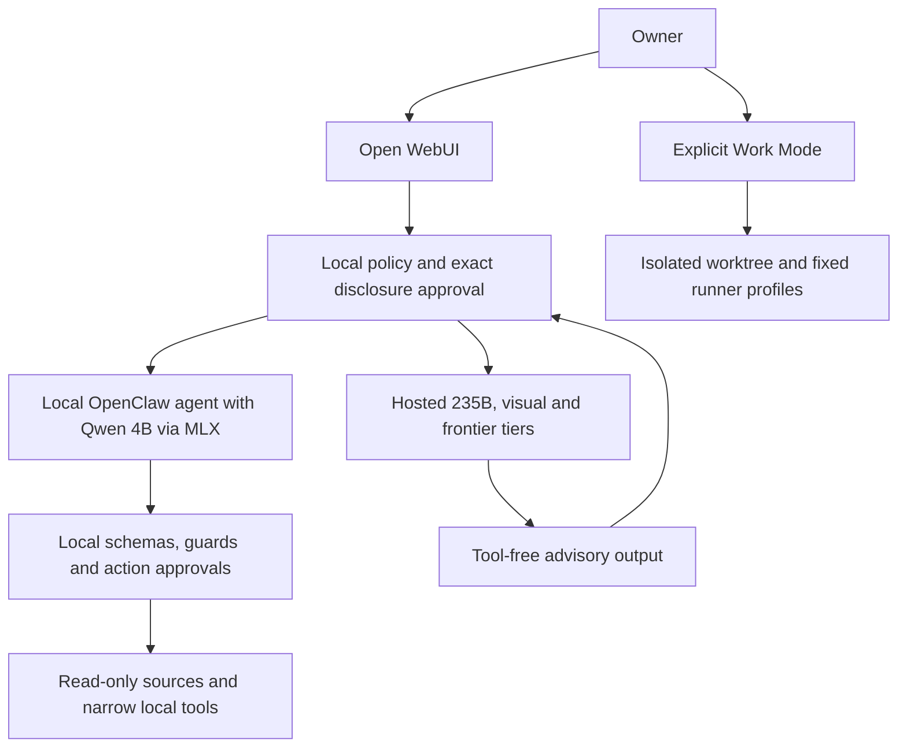

<p align="center">
  
</p>

# Sanctum

**Local authority for hybrid personal AI.**

Own the authority. Rent the intelligence when you need it.

Sanctum keeps credentials, tools, approvals and privacy policy on your machine while reasoning can move between local, private and hosted models. It exists to make a personal assistant useful without making a model mistake an unrestricted computer action.

**Reasoning is replaceable. Authority stays local.**

## V1.3 development

V1.3 development starts from the immutable V1.2.0 release on `v1.3-dev`.
Linear project `Sanctum V1.3` is the work and decision record; implementation
still requires the owner to set both `Ready for Agent` and `symphony`, runs at
concurrency one, opens an unmerged PR to `v1.3-dev`, and stops at `Human
Review`. Project membership and the `v1.3.0` milestone do not authorize work.
See the [V1.3 development bootstrap](docs/current/agent-system/V1.3-DEVELOPMENT-BOOTSTRAP.md).

The integration line also contains conversational WebUI consent, explicit
Assistant/Work Mode separation, bounded Work Mode create/delete/move and exact
multi-file text patches, and restricted content telemetry. These are not a
V1.3 release claim. Evaluators should follow the
[end-to-end quickstart](docs/guides/quickstart.md) and the documented upgrade
checkpoints instead of copying commands from historical evidence.

## V1.2 release

Sanctum V1.2.0 is **complete with documented limitations**. This backward-compatible release retains the V1.1 shared-capability, Source-First and private Qwen Work Mode boundaries while adding bounded agent management, qualified Linear workflows, feedback-aware Symphony execution, a narrow host-owned Git control plane, stronger repository/CI integrity and gateway-only Splunk observability. The original V1.0.0 and V1.1.0 releases and tags remain immutable. The original deployment was called **VinceAI** and remains the reference installation; publication does not migrate or redeploy it. Source and documentation use [Apache-2.0](LICENSE), with [external licenses retained](THIRD-PARTY-NOTICES.md).

Full operation targets **macOS on Apple Silicon**. This is **hybrid packaged / container-assisted** software: MLX, personal-source brokers, credentials, approvals and GPU cleanup intentionally remain host-native. Optional containers provide a small fixed MCP surface.

## Install and run locally

Requires Node 26.8.1, Python 3.12 and uv. These checks need no personal accounts or paid-provider credentials. Clone this repository or unpack the source release, then run:

```sh
git clone https://github.com/vnsparacio/sanctum.git
cd sanctum
./sanctum setup --prefix /absolute/private/prefix
./sanctum start --prefix /absolute/private/prefix
```

The resumable setup runner installs source dependencies when needed, creates
the isolated private prefix, installs the pinned MLX and Open WebUI runtimes,
and downloads the pinned local model only when it is absent. `start` supervises
MLX, the gateway, every configured broker and WebUI behind one command. Use
`./sanctum status --prefix ...`, `./sanctum ready --prefix ...` and
`./sanctum stop --prefix ...` for service inspection, end-to-end setup
readiness and clean shutdown. Startup safely quarantines exact owner-controlled
broker sockets only after proving they have no listener. Credentials, Google
OAuth, macOS privacy grants and first WebUI enrollment remain explicit owner
checkpoints. The [end-to-end
quickstart](docs/guides/quickstart.md) covers optional integrations, model
selection and those one-time checkpoints.

`--prefix` defaults to `$SANCTUM_PREFIX` when set, otherwise to
`$HOME/.local/share/sanctum-v1`. Exporting `SANCTUM_PREFIX` once makes routine
operation simply `./sanctum start`, `./sanctum ready`, `./sanctum status` and
`./sanctum stop`.

## How it works



The local agent can use narrowly configured tools. Stronger private or hosted models receive locally selected evidence under the gate's disclosure rules and return advice; they do not inherit Mac tools or action authority. Model pins and provider eligibility are versioned policy, not a promise of permanent provider availability.

In Open WebUI, select **Mac prompt gate**, not the raw MLX provider. Ordinary
text enters Assistant Mode. The gate selects an eligible reasoning tier under
policy; `/gate ask-235` and `/gate ask-strong` request specific stronger routes,
and hosted disclosure is confirmed in an authenticated dialog. Work Mode never
starts from ordinary chat and requires an explicit `/work` command.

## Capabilities and deliberate limits

- Read bounded Messages, Gmail and Calendar data; summarize and generate unsent drafts. Sending and calendar mutation are unavailable.
- Create Markdown in fixed destinations without overwriting. Inspect files and perform scoped move/rename/undo with one-use approval; generic deletion and arbitrary writes are unavailable.
- Browse through an isolated profile and guarded interactions. Arbitrary evaluation and other browser profiles are blocked.
- Use exact local utilities and a fixed MCP catalog. Generic shell, dynamic tool discovery and remote-model local tools are unavailable.
- Escalate reasoning under exact disclosure, budget and GPU ownership controls. Paid GPU autostart ships disabled and requires operator setup plus independent cleanup.
- Run explicit Work Mode tasks in isolated worktrees with bounded exact replacement, text-file create/delete/move, exact preflighted multi-file text patches and fixed-profile repository commands. Path escape, fuzzy/binary/vendor/generated edits, live host mounts, networked runner commands, Docker-socket access and inherited credentials remain unavailable.
- Manage work through bounded Repo Steward, Product Scout and Triage roles; run owner-authorized implementation through Symphony in isolated workspaces; stop every implementation at Human Review. Management agents cannot set execution gates, edit source or merge.
- Emit optional metadata-only gateway traces and bounded custom metrics directly to Splunk Observability Cloud while preserving the existing private-spool/S3/Splunk Enterprise path. Telemetry is fail-open and has no authority or completion role.

Sanctum does not promise full autonomy, universal factual accuracy, full Linux
product parity, an all-Docker deployment or guaranteed cleanup during
simultaneous Mac/network/provider outages. V1.3 Work Mode broadens only its
bounded isolated text-worktree operations; it still has no arbitrary host
filesystem or generic shell authority. Fresh core setup does not automatically
enable Work Mode. The agent-management path requires human execution gates,
review and merge. Splunk coverage does not include agent, GPU, host or provider
monitoring. The local model's browser-target selection and exact draft
formatting have recorded failures. A reviewed moderate Vitest/mocker advisory
remains in development tooling; the vulnerable dev-server path is unused by
the prescribed tests. See [the V1.2 release record](docs/history/v1.2/V1.2-RELEASE-COMPLETION.md), [current limitations](docs/current/limitations.md), [the V1.1 release record](docs/history/v1.1/V1.1-RELEASE-COMPLETION.md) and [dependency review](docs/development/dependency-review.md).

## Read more

- [Documentation map](docs/README.md), [architecture](docs/architecture/architecture.md), [security](SECURITY.md), [privacy](docs/architecture/privacy.md)
- [Canonical Sanctum V1 project report](docs/history/v1/SANCTUM-V1-PROJECT-REPORT.md): failed experiments, routing research, design evolution, benchmarks, lessons and operator guidance
- [V1.3 development bootstrap](docs/current/agent-system/V1.3-DEVELOPMENT-BOOTSTRAP.md), [V1.2 release completion](docs/history/v1.2/V1.2-RELEASE-COMPLETION.md), [agent-system runbook](docs/current/agent-system/V1.2-AGENT-SYSTEM-RUNBOOK.md), [Linear integration](docs/guides/linear-agent-integration.md), [Splunk Observability](docs/observability/SPLUNK-O11Y-CLOUD.md)
- [Naming and retained compatibility identifiers](docs/architecture/naming-compatibility.md), [rename audit](docs/history/v1/SANCTUM-RENAME-AUDIT.md)
- [End-to-end quickstart](docs/guides/quickstart.md), [installation and upgrades](docs/guides/installation.md), [configuration](docs/guides/configuration.md), [operations](docs/guides/operations.md), [troubleshooting](docs/guides/troubleshooting.md)
- [Capabilities](docs/architecture/capabilities.md), [limitations](docs/current/limitations.md), [container boundary](docs/architecture/containerization.md)
- [Testing](docs/development/testing.md), [contributing](CONTRIBUTING.md), [roadmap](docs/current/roadmap.md)
- [Release qualification checklist and publication procedure](docs/guides/release.md#release-qualification-checklist), [separately approved migration and rollback](docs/guides/migration.md)

The project report is canonical for history and intent. The qualified source and acceptance records govern current implementation behavior where historical narrative differs.
