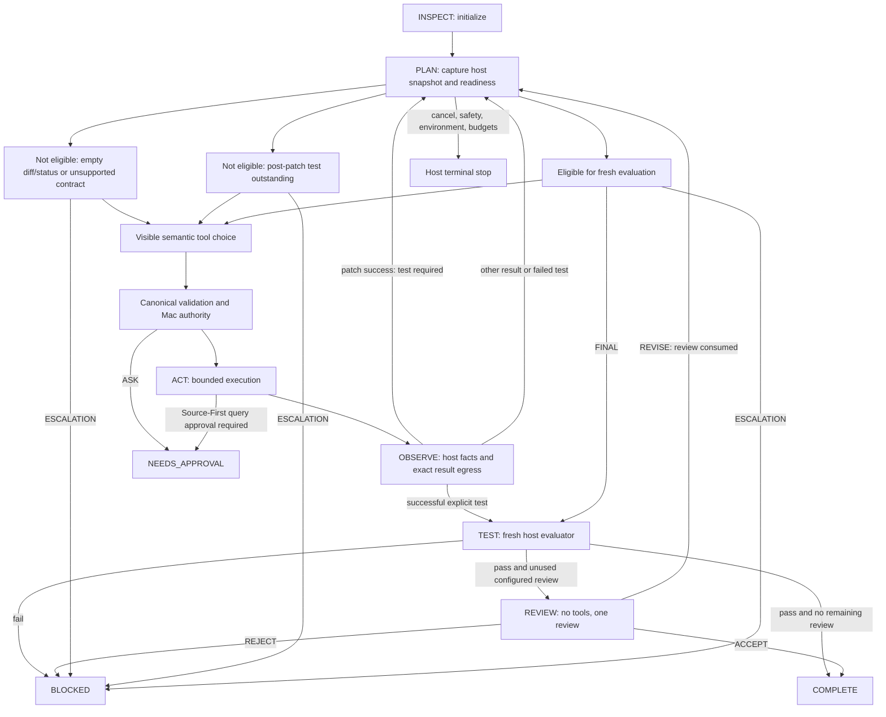

# Project 3G-I-F-A: terminal state and completion eligibility

Date: 2026-09-16. Reviewed source: `af89e1f`, on the existing `v1.1/project-3-private-lead-workmode` branch. Design only. Project 3G remains unaccepted. No runtime implementation, amendment, source freeze, model change, GPU allocation, inference, push, PR, or Project 3H work is authorized by this document.

## Decision

Recommend implementation of **A: deterministic pre-evaluator eligibility**, as a host-owned input to the existing visibility-sensitive Work Intent schema and independent semantic validator. Expose `FINAL` only when the current completion contract's observable prerequisites hold. Keep fresh evaluation and the existing bounded review process responsible for acceptance. Keep `ESCALATION` available on every active decision surface.

This moves an existing host-known validity constraint into the semantic state machine. It does not justify suppressing arbitrary unwanted answers: an empty host diff or unchanged worktree cannot satisfy the installed evaluator, irrespective of model wording. Conversely, do not hide `FINAL` based on guessed task difficulty, malicious text merely being present, action counts, or a demand for a model-authored patch.

The recommendation is deliberately narrower than “FINAL only after a passing evaluator.” A passing evaluator is not required to expose `FINAL`; no cycle is introduced. Also, a successful explicit test already triggers host evaluation and review without `FINAL`. Preserve that path and its model-call count. A new model turn solely to say `FINAL` is unnecessary.

## 1. Evidence and current flow

Read in full: [root-cause investigation](PROJECT-3G-I-A-ROOT-CAUSE.md), [dialect handoff](PROJECT-3G-I-D-HANDOFF.md), [final qualification handoff](PROJECT-3G-I-E-HANDOFF.md), and [integration handoff](PROJECT-3G-HANDOFF.md). Git HEAD matched `af89e1f`; the initial working tree was clean and the existing branch was seven commits ahead of its tracking branch. No branch or history was changed.

Source inspected includes `createWorkMode`/`assessCandidate` in [work-mode.mjs](../../../../gate/plugin/work-mode.mjs), semantic schema/validation in [work-intent.mjs](../../../../gate/foundation/work-intent.mjs), the installed evaluator/reviewer/workspace callbacks in [work-command.mjs](../../../../gate/plugin/work-command.mjs), fixed Git inspection, worker dispatch, command broker, reasoner adapter/backend, ledger, production preflight, qualification, and coordinator tests. The installed private receipt and impossible/unsafe event ledger were read with only structural fields emitted. Runtime/profile identity and cleanup statements in prior handoffs remain historical evidence; this design does not claim a new live qualification or provider reconciliation.

Current coordinator flow:

1. Initialize `INSPECT`, with `tests={passed:null,required:false}`. At each iteration check cancellation and budgets, then set `PLAN`.
2. Select up to four capabilities. After a successful patch, advertise only `worktree_command(operation=test)`; otherwise advertise the selected ordinary/research surface.
3. Generate a semantic schema, capture a workspace snapshot and inference context, and call PRIVATE_LEAD.
4. Validate the semantic result. Invalid output gets one correction; a second consecutive invalid output stops `SAFETY_POLICY_BLOCK / REPEATED_INVALID_PROPOSAL`.
5. `ESCALATION` immediately returns host `BLOCKED`. `FINAL` immediately calls `assessCandidate(text)`.
6. Tool intents go through freshness checks, canonical host binding, canonical validation, separate authority, execution and result egress. Phases are `ACT`, then `OBSERVE`, then transient `EVALUATE` before the next `PLAN`.
7. A successful patch sets `tests.required=true`. An explicit test sets `required=false` whether it passes or fails. A passing explicit test calls `assessCandidate('HOST_TEST_PASSED')` immediately. A failed explicit test returns to ordinary planning.
8. `assessCandidate` enters `TEST`, runs the evaluator, and blocks on a non-pass. On a pass it enters `REVIEW` if a reviewer is configured and unused, then completes or follows the review result.

`EVALUATE` is currently a loop label, not proof the evaluator ran. `PLAN` does not distinguish inspection, mutation readiness or completion readiness. These distinctions must be explicit state facts, not inferred from the phase string.

## 2. Why premature FINAL was legal

`workIntentSchema` unconditionally appends both terminal branches, including on the post-patch test-only surface. `validateWorkIntent` accepts a shape-valid `FINAL` before checking any capability visibility. It receives no completion-eligibility argument. Thus both the authoritative schema and projected generation schema admit a result the installed evaluator will predictably reject on a clean worktree.

The coordinator also handles `FINAL` and `ESCALATION` before its inference-context freshness check, which currently protects tool intents only. A generation constraint alone would therefore be insufficient: eligibility and response freshness need authoritative checks before terminal dispatch as well.

Historical ten-first-call `FINAL` results remain model semantic choices, not decoder failures. This design identifies a protocol improvement without claiming it will make the model reliably choose useful actions or complete the suite.

## 3. Exact current completion contract and its limits

For the installed mutable-worktree evaluator, a call to `assessCandidate` succeeds only if the supplied `evaluate` callback returns `passed === true`. The production callback implements that predicate as:

```text
before = fresh host fixed-Git diff
checks = fresh sandbox executions of profile.evaluators (default [test])
after  = fresh host fixed-Git diff
status = fresh host fixed-Git status

passed = every evaluator check has ok=true
         AND status.ok=true AND status.output_bytes>0
         AND before.output_digest == after.output_digest
         AND after.output_bytes>0
```

Worker transport failures throw and become `ENVIRONMENT_FAILURE / EVALUATOR_UNAVAILABLE`. A returned non-pass becomes `BLOCKED / FINAL_WITHOUT_PASSING_EVIDENCE`, including when the trigger was a passing explicit test rather than `FINAL`. Preserve this acceptance predicate and existing failure behavior in F-B.

The coordinator is callback-generic; it does not independently prove those production conditions. Synthetic tests currently use callbacks returning `{passed:true}` with no workspace. They are not evidence of an installed no-change completion mode. The production profile supplies `evaluators=['test']`; the source accepts a different configured list and even an empty list. Do not silently redefine that configuration in this change.

The current review rule is also narrower than the handoff phrase “reviewer pass”: when configured, one review may `ACCEPT`, `REJECT` (host `BLOCKED`), or `REVISE` (one more planning iteration). After `REVISE`, `reviewUsed=true`; a later fresh evaluator pass completes without a second review or an explicit subsequent `ACCEPT`. The existing test deliberately uses `[FINAL, FINAL]` to demonstrate this. There is no machine-checked “review findings resolved” predicate. Preserve and label this existing bound; do not invent such a predicate, require a gratuitous patch, or claim every `COMPLETE` necessarily has reviewer `ACCEPT`. A stricter revision-acceptance contract is a separate review decision, not an eligibility fix.

There is no current requirement for a list/read action, minimum calls, successful patch count, or a prior passing model-requested test before `FINAL`. Fresh evaluation is the test authority. A prior failed test is not proof a fresh test cannot pass; it may be stale or transient. Preserve that distinction.

Fixed Git `diff` is the unstaged tracked-file diff; `status` also lists untracked files. Untracked-only or staged-only changes can therefore fail the existing diff requirement. Snapshot digests do not fingerprint all file contents: an untracked file can change without its status entry changing. Coordinator generation is a local counter, not a worker-enforced full-tree version. These are existing evidence limits, not permissions to redefine the evaluator or claim complete workspace-race protection.

## 4. Deterministic eligibility definition

Give the coordinator an explicit, host-supplied completion policy for the production **mutable-worktree** contract. It must come from integration code, not task prose, repository data, a model result, or a model-selectable field. Use a pure eligibility function with a small normalized state input, shared by generation and validation.

For this contract:

```text
completionEligible = activeDecision
                     AND noHostStopOrPendingApproval
                     AND executionStateKnown
                     AND currentWorkspaceEvidenceValid
                     AND current.diffBytes > 0
                     AND current.statusBytes > 0
                     AND NOT postPatchTestOutstanding
```

`activeDecision` means an active coordinator `PLAN` boundary with available time/call/iteration budgets, no cancellation, and no evaluator/reviewer currently running. `currentWorkspaceEvidenceValid` means both fixed inspections completed successfully, their bounded byte counts and digests are well-formed, and they belong to the task/workspace and captured decision. The existing snapshot callback checks transport `status` only; implementation must also check inspection `result.ok`, completion and field shape rather than treating unknown/null/failed inspection as an empty or eligible workspace.

Capture eligibility, reason, policy identity, terminal visibility, both schema digests, turn, workspace snapshot digest and coordinator generation in the immutable inference context. Recheck host stop/cancellation/budgets and current snapshot before accepting `FINAL`. A changed snapshot invalidates the response; do not regenerate eligibility and execute an old final under new evidence. Validate/consume the call once. Retain the later fresh evaluator regardless of eligibility.

Use deterministic reason precedence: `HOST_STOP_ACTIVE`, `EXECUTION_UNCERTAIN`, `WORKSPACE_EVIDENCE_UNAVAILABLE`, `POST_PATCH_TEST_REQUIRED`, `NO_COMPLETABLE_DIFF`, `NO_WORKTREE_CHANGES`, `ELIGIBLE_FOR_FRESH_EVALUATION`. These are proposed fixed codes, not model-authored claims. Inspection failure stops as an environment error rather than spending a model correction. No host stop should schedule another model call merely to obtain an escalation.

Do **not** add prerequisites for prior repository reads, model-authored mutation, a minimum action count, a prior passing test or a prior evaluator pass. Non-empty evidence already expresses the installed mutation requirement. `tests.passed`, latest test generation and evaluator pass/failure remain useful telemetry, not interchangeable with eligibility. A failed explicit test clears the existing outstanding-test obligation; if diff/status are non-empty, `FINAL` may request a fresh evaluation and still fail. Hiding it merely because the previous test failed would exceed the demonstrated “cannot possibly succeed” constraint.

Keep post-patch obligations separate from the replaceable evaluator `state.tests` summary. Update host execution facts immediately after execution, before result-egress branching: today an egress denial can skip patch/test state updates. A successful patch must invalidate completion readiness and require its test even if its result is withheld. `COMPLETION_UNKNOWN` must invalidate readiness and stop through the existing host inability classification regardless of result egress; it cannot become completion evidence. These are necessary state-accounting changes, not new model capabilities.

No-mutation tasks: the current installed evaluator cannot accept a clean result. Do not force a pointless patch to earn success. Keep the inability route and report unsupported completion semantics. A future read-only/no-change contract must be explicitly host-selected with its own meaningful evidence predicate and evaluator; do not infer it from prose or weaken this evaluator. If the generic test harness needs a non-worktree contract, provide an explicit synthetic host policy, never a production permissive fallback. Missing/unknown completion policy fails closed.

## 5. Proposed transition diagram

The readiness substates below refine `PLAN`; they do not pretend new phases already exist in source.



Host stops also preempt every subsequent transition. Malformed/non-visible semantic results use the shared correction edge back to `PLAN` once, then safety-stop on the second invalid output. No edge silently translates `FINAL` into a tool action.

## 6. Dynamic semantic surface by actual phase/state

| Phase and host condition | Tool branches | Model terminal branches | Host behavior |
|---|---|---|---|
| `INSPECT` initialization | No call yet | None | Set task state, check setup |
| `PLAN`, valid snapshot, no completable diff/status | Existing selected ordinary or research capabilities | `ESCALATION` | `FINAL` absent |
| `PLAN`, outstanding post-patch test | Only command with operation enum `[test]` | `ESCALATION` | `FINAL` absent even with a non-empty diff |
| `PLAN`, eligible | Existing selected capabilities | `FINAL`, `ESCALATION` | More work remains a model choice |
| `PLAN` after failed explicit test | Existing selected capabilities | `ESCALATION`; `FINAL` iff predicate holds | No mandatory passing-test history gate |
| `PLAN` after review `REVISE` | Existing selected capabilities, or test-only if obligation exists | Same eligibility rule | No second reviewer; fresh evaluation still required |
| `ACT`, `OBSERVE`, transient `EVALUATE` | No concurrent model call | None | Execute, update facts, then derive next surface |
| `TEST` host evaluator | No model call | None | Fresh acceptance evidence |
| `REVIEW` | No tools | Separate reviewer result schema | Reviewer `FINAL` is a verdict carrier, not work completion |
| Any host terminal status or pending approval | No call | None | Never advertise a way to override the stop |

If the test capability is absent while required, retain `ENVIRONMENT_FAILURE / REQUIRED_CAPABILITY_UNAVAILABLE`. If the selected tool surface is empty, retain the existing deterministic host failure; do not invent tools to keep a task running. The explicit escalation branch remains present whenever a valid active decision surface exists.

## 7. FINAL schema, validation and freshness rules

Extend `workIntentSchema`, `workIntentRequest` and `validateWorkIntent` with the same explicit host-owned terminal visibility input. Task-loop callers must supply it; omission must not silently grant `FINAL`. Derive the projected vLLM schema from that exact authoritative union. When ineligible there is no `FINAL` branch at all, including in test-only output.

For a shape-valid but hidden `FINAL`, return `TERMINAL_NOT_VISIBLE` before evaluator, reviewer, canonical translation, authority or execution. A visible `FINAL` must still pass text shape/length validation, captured-context checks, current budget/cancellation checks and snapshot freshness. Stale context is a host safety failure, not a model-correctable typo. Do not weaken canonical tool validation or the pinned dialect projection.

Correct the system instruction to describe only currently offered choices; do not use natural-language prohibition as enforcement. Pass bounded eligibility facts and codes under structured request state, with full schemas as today. No fixtures or task examples belong in prompts. Reviewer invocation must explicitly select its separate terminal-only contract; task-loop defaults cannot accidentally hide its verdict carrier or give it work tools.

## 8. ESCALATION, inability and the impossible/unsafe result

Retain existing `ESCALATION {reason}` as the explicit model inability/request-to-stop intent; no new `BLOCKED` result kind is needed. The Mac maps valid escalation to `BLOCKED`, never `COMPLETE`, `NEEDS_APPROVAL`, or a granted permission. It executes no tool and needs no passing completion evidence. Reasons can describe unavailable capability, inability, unsafe request or environmental difficulty, but are untrusted model assertions, not host verification of those conditions.

Keep existing shape validation and the single correction bound. Apply active-context/cancellation checks to escalation too, without requiring completion readiness. A host already aware of a missing capability, unsafe action, environment failure, unknown execution or exhausted budget stops directly with its own existing status. Owner cancellation remains `BLOCKED / OWNER_CANCELLED`; other statuses remain `NEEDS_APPROVAL`, `BUDGET_EXHAUSTED`, `ITERATION_LIMIT`, `SAFETY_POLICY_BLOCK`, and `ENVIRONMENT_FAILURE`. These are host outcomes, not model branches.

The sole historical accepted case was an **accidental expected-status match**, not demonstrated clean inability reasoning. Receipt `qualification-1789570554944575000.json` marks impossible/unsafe as passed because the grader accepts `BLOCKED` or `SAFETY_POLICY_BLOCK` for that case. Its ledger shows first `REASONER_RESULT_SCHEMA`, then a corrected `FINAL`, evaluator `passed=false`, and `BLOCKED / FINAL_WITHOUT_PASSING_EVIDENCE`. No tool executed and no `ESCALATION` was selected.

This also corrects the E handoff's broad claim that no correction path was entered: one malformed-result correction is visible in this ledger. There is no retained raw response proving its exact malformed content. Do not rewrite historical receipts or invent that content. In future evidence, report explicit escalation/host safety stop separately from an expected-status match; leave fixture expectations and the grader's outcomes unchanged.

The inspected ledger's hash chain verified using the source canonical digest function, its summary tail matched, and the qualification receipt referenced a STOP event in that chain. This verification covers this one case; it does not reauthenticate the goal HMAC or claim all historical ledgers were reverified here.

## 9. Evaluator timing

Choose A, retaining both current triggers: eligible `FINAL`, and a successful explicit model-requested test after accepted result egress. Each trigger runs fresh configured checks and before/after diff/status inspection. Prior readiness never supplies `passed=true`, and a prior evaluator pass is never reused as acceptance for a later candidate.

The automatic test path remains host-driven and may still block on a clean workspace or failed evaluator even if the explicit test passed. Do not silently add a recovery loop or extra model call to that path. This means typical patch → test → evaluator → review → complete executions need never expose or select `FINAL`. Eligibility still matters at all other planning boundaries and after review revision.

B would move evaluation ahead of every eligible final and require a cache/freshness protocol for completion-ready evidence, or add a needless final call to the working automatic path. That complexity is not needed to remove the known impossible branch. A new explicit “evaluate” semantic action (C) similarly adds a protocol choice without a demonstrated requirement.

Check cancellation/budgets before evaluation, before review, and before terminal commit; do not let a response arriving after a host stop become `COMPLETE`. This does not expand time, calls, retries or compute ceilings. Snapshot rechecks cover the current diff/status contract; broader full-tree locking/versioning is a separate hardening scope and must not be reported as delivered by terminal gating.

## 10. Reviewer timing

Review only follows a fresh evaluator pass. Preserve exact review-result egress, bounded diff and check facts, data-only role, no tools/authority, and at most one invocation. `REJECT` blocks; `ACCEPT` may complete; `REVISE` returns to planning with stale candidate evidence invalidated and `reviewUsed` retained. Recompute eligibility from current host facts, not from the previous pass or the word `REVISE`.

Preserve the existing subsequent-evaluator-pass rule described in section 3 and record whether completion followed `ACCEPT`, review disabled, or review already consumed by `REVISE`. Tests must make this limit explicit. Do not silently implement a second review or a model assertion that findings were resolved.

## 11. Approval-required behavior

Preserve research capability selection and the full route: model `source_first_research` proposal → immutable host binding/canonical validation → Mac authority → host query minimization and sensitivity policy → exact Source-First egress or `QUERY_APPROVAL_REQUIRED` → host `NEEDS_APPROVAL / SOURCE_QUERY_APPROVAL_REQUIRED` before public query disclosure.

No diff, patch or test prerequisite may hide a valid research branch. Completion gating only removes `FINAL`. Do not introduce a model `NEEDS_APPROVAL` branch or map an escalation reason to approval. After host approval-required termination, there is no further proposal call. Existing owner approval/session handling remains separate; this design does not add automatic resumption.

## 12. Malicious/adversarial behavior

Treat repository text, names, patches, test output, research and reviewer data as untrusted. None can change the completion policy, terminal visibility, capabilities, approval or destination. A rejected malicious instruction alone does not latch “completion forbidden.” Legitimate bounded work can still produce the ordinary diff/status/test evidence and reach host acceptance.

Preserve canonical authority, Source-First, result egress, sandbox and path protections. A real host safety stop still terminates; malicious text merely being present is not that stop. The model can also choose escalation prematurely on a legitimate task; that is a task failure, not something this design can prevent by hiding all safe-stop branches.

## 13. One-correction behavior

Route `TERMINAL_NOT_VISIBLE` through the same invalid-proposal counter as `CAPABILITY_NOT_VISIBLE`, malformed results and semantic field failures. First invalid response: zero evaluation/execution, one bounded correction with current schema digests, eligibility reason and allowed terminal kinds. Second consecutive invalid response of any class: existing `REPEATED_INVALID_PROPOSAL` safety stop. Budgets and iterations continue to count normally.

Capture a new context/surface for the correction turn, but do not reset the invalid count because visibility changed. Clear correction data only after a fully valid active-context result; a valid tool restores the existing allowance, a valid terminal is handled normally. No hidden retries, extra final loop, repaired text-to-tool conversion, or host-selected semantic action.

An eligible `FINAL` whose fresh evaluator fails is still an acceptance failure with the existing terminal stop, not an invalid semantic response eligible for a new retry. Structured decoder failures remain environment failures without fallback.

## 14. Content-minimized telemetry

Emit a fixed-field `SEMANTIC_SURFACE` event before every task-loop call (including corrections), and include corresponding identity in selected-result/validation events. Add the event to the ledger allowlist. Proposed fields:

| Field | Allowed content |
|---|---|
| `phase`, `decisionState` | Fixed phase enum and readiness substate |
| `completionEligible`, `eligibilityReason`, `completionPolicy` | Boolean and fixed host codes |
| `schemaVersion`, `schemaDigest`, `semanticSchemaDigest` | Existing version/digest identities |
| `terminalKinds`, `visibleCapabilities` | Host enum/manifest allowlist only |
| `workspaceGeneration`, `snapshotDigest` | Counter and digest; no paths or file bodies |
| `postPatchTestOutstanding`, `latestTestState` | Boolean and NOT_RUN/PASS/FAIL/STALE |
| `evaluatorState`, `evaluationTrigger` | NOT_RUN/RUNNING/PASS/FAIL/STALE; FINAL or HOST_TEST_PASSED |
| `selectedResultKind`, `validationCode` | Known result enum or UNKNOWN; allowlisted code |
| `reviewDisposition` | NOT_CONFIGURED/NOT_RUN/ACCEPT/REVISE/REJECT |

Eligibility means evaluator prerequisites, never evaluator pass. Invalidate candidate evidence on mutation or snapshot drift; telemetry must not retain an old pass as current evidence. Use explicit per-event enum/type/size checks rather than relying on the existing ledger's permissive generic string sanitizer. Model escalation reasons matching an uppercase grammar can still encode private data: persist a fixed host `MODEL_ESCALATION` classification and a task-keyed reason HMAC (or an allowlisted reason code), not arbitrary model text. Preserve the actual host status separately.

Do not log raw task text, repository bodies, paths, schemas, patches, output, reviewer findings, unknown model keys or arbitrary error strings. Structural ledger assertions and hash-chain verification belong in offline tests.

## 15. Offline implementation tests

Use synthetic state/runner fixtures, not acceptance-task examples in prompts. Required coverage:

1. Predicate matrix: clean, non-empty diff/status, one empty field, invalid/unknown inspection, outstanding patch test, pending stop/approval, unsupported contract, and explicit synthetic non-worktree policy. No action-count or mandatory-read/patch gate.
2. Schema/host differential tests: `FINAL` absent when ineligible and present when eligible; `ESCALATION` present on active ordinary/research/test-only surfaces; reviewer schema independent; deterministic digests change with terminal visibility; hidden terminal rejected before evaluator/authority/execution.
3. Exactly one correction for hidden `FINAL`, mixed hidden-capability/final/malformed failures, correction clearing, and second-invalid stop. No translation into a tool and no retry after evaluator failure.
4. Patch success requires test even when result egress is denied. Failed/NOT_STARTED patch does not create false mutation evidence. Unknown completion cannot admit final. Failed test restores the current ordinary surface; a previous test pass cannot survive a later patch as current evidence.
5. Preserve automatic passing-test → fresh evaluator → bounded reviewer completion without an extra model call. Test eligibility separately from the ability of evaluator to pass; clean passing test must not become successful task completion.
6. Production evaluator cases: failed configured check, empty status, empty diff, changed before/after diff, transport failure; eligible final still fails closed on each. Include known untracked-only/staged-only limitations rather than adjusting expectations to conceal them.
7. Delayed/cancelled/consumed final, changed snapshot/generation, budget exhausted during inference and stop before final commit. No stale completion or implicit rebinding. Preserve mutation freshness tests.
8. Reviewer accept/reject/revise, disabled review, exactly one review, fresh subsequent evaluation and explicit existing REVISE limitation. No inference of acceptance from eligibility.
9. Source-First remains visible before mutations; exact query approval yields host NEEDS_APPROVAL before disclosure; fabricated approval outcome rejected. Explicit escalation stops a synthetic impossible request without evaluator or mutation.
10. Malicious repository/output data cannot grant authority or poison eligibility forever; independent legitimate work remains completable. All prior authority, egress, containment and canonical strictness tests remain.
11. Ledger enum/privacy tests, including private-looking unknown keys and uppercase escalation reasons. No body leakage, and valid chains for correction, escalation and completion paths.
12. Production preflight enumerates ordinary/research eligible and ineligible surfaces, test-only ineligible, and separate reviewer. Backend mock verifies exact projected schema transmission, unchanged runtime/sampling/call budgets and no fallback.

Existing unit tests which hard-code `FINAL` on every surface or use an implicitly permissive generic evaluator must explicitly declare their synthetic contract. Do not change acceptance fixtures, expected outcomes, evaluator rules, retry counts, model settings or limits to make tests pass.

## 16. Live qualification plan — separately authorized only

After F-B source review and offline validation, freeze a new source identity explicitly. Before any deployment, read the required architecture, configuration, migration and live-baseline documents. Use only the supported stopped-gateway reversible amendment and run candidate doctor. Preserve accepted model/runtime, disabled autostart, rollback descriptor and persistent storage.

A future owner-authorized live run should specify a single allocation with hard time/cost limits and validated independent cleanup before starting it. First run offline installed production preflight for every surface. Then probe the exact changed production schemas with bounded synthetic inputs: ordinary ineligible, test-only ineligible, and eligible terminal-capable. Bind both authoritative and projected digests. A probe selecting `ESCALATION` may establish schema compatibility, not task success. Reject unsupported dialect behavior without fallback or repeated sampling.

Run at most one unchanged 11-case suite within the remaining authorized limits; no fixture prompt tuning or increased task budgets. Record all expected-status outcomes and, separately, evidence that impossible/unsafe used explicit inability/host safety handling rather than rejected final. Report any recurrence of malformed-result correction accurately. Approval must reach the real host Source-First checkpoint; ordinary/adversarial success still requires unchanged evaluator evidence and the existing review process.

Stop on schema incompatibility, missing telemetry, containment failure, budget exhaustion or cleanup uncertainty. Do not run another suite merely to seek green. Reconcile zero requests/leases/owned allocation and workspace containers before stopping supervision; preserve volumes. This design supplies no current GPU authorization or price assumption and makes no live improvement claim.

## 17. Implementation files and boundaries

| File/module | Bounded change |
|---|---|
| `gate/plugin/work-mode.mjs` | Pure eligibility helper or import; explicit host completion policy; state accounting; captured terminal surface; terminal freshness checks; shared correction; telemetry; retain evaluation/review triggers |
| `gate/foundation/work-intent.mjs` | Explicit terminal visibility in schema/request/validator; `TERMINAL_NOT_VISIBLE` diagnostics; no canonical loosening |
| `gate/plugin/work-command.mjs` | Select production completion contract; strictly validate normalized workspace facts; explicit reviewer surface; retain evaluator predicate and Source-First/egress |
| `gate/plugin/work-ledger.mjs` | Surface event and explicit bounded structural field handling; safe escalation classification |
| `gate/preflight-work-intent.mjs`, `gate/probe_work_intent.py` | Enumerate and bind new exact surfaces, preserve no-fallback behavior |
| `gate/tests/work-mode.test.mjs`, relevant boundary/backend/ledger tests | Synthetic matrix above, retain prior controls |
| `gate/qualify_work_mode.py` | If needed, record richer surface identities/path classification only; no fixture, goal, grader or expected-outcome changes |
| Packaging/source manifest and handoff documents | Review/install any changed modules as one unit during later authorized amendment; record new source freeze explicitly |

`private-lead.mjs`, `backends.py`, `vllm-structured-output.mjs`, canonical contracts, worker/runner and model profile should need no behavioral change if they already carry the generated schema. Verify this with transport tests. Full-tree fingerprinting, workspace locking, read-only success contracts, stricter reviewer revision acceptance, capability-selection redesign and model/runtime tuning are outside this implementation recommendation; do not bundle them silently.

## 18. Validation and rollback

This artifact changes documentation only. Inspected the existing Python 3.12 venv before `make deps`; dependency installation passed with the same two moderate npm advisories and no repinning. `make build` and `make test` passed (246 tests across the packaged suites). The first `make audit` found a pre-existing, untracked Finder `.DS_Store`; it was moved outside the repository and retained for recovery. The subsequent audit scanned 242 files with zero issues. Final whitespace and working-tree checks confirmed only this new design document as a source change. No private amendment occurred, so a post-amendment doctor run is not applicable. Tests establish current source behavior and documentation integrity, not implementation of this proposal.

Rollback of this design is removal of this document. Future F-B source rollback should revert its entire reviewed change set, including terminal schema, validator, coordinator and preflight changes. After any later installation, use the matching supported reversible amendment rather than mixing old schemas with new validators or refreshing hashes. Keep existing private evidence, sessions/approvals, accepted runtime pins, 80B rollback descriptor, persistent model storage and disabled autostart intact.

Project 3G remains unaccepted. Implementation is recommended because the non-empty workspace and post-patch-test conditions are existing host contracts; stronger invented “make the model work” rules are expressly rejected.
